# House of Arshi: Mobile Readiness & Site Audit

**Site:** https://www.houseofarshi.com
**Code audited:** `house-of-arshi-site/` on `main` at commit `abfc131` (spot checks show the live site serves these same files)
**Date:** 27 September 2026

> **Bottom line.** On a phone today, a shopper cannot open the menu, cannot see a product's
> sizes or *Add to Cart*, cannot use the bag page, and cannot reach *Place Order*. Separately,
> login, sign-up and checkout fail for **every** visitor on **any** device, because the site
> still points at a developer's local server and never loads the payment script.
>
> Most of the phone breakage comes from two small root causes: CSS rules in the wrong order,
> and a navbar that is wider than a phone. A fix for both was tested on a scratch copy of the
> site. It restores the product popup, bag and checkout on 360 px and 390 px phones
> (before/after screenshots in [C3](#c3-the-product-popup-is-unusable-on-phones-and-tablets)
> and [C4](#c4-bag-page-and-checkout-break-on-phones-and-tablets); patch in
> [Appendix D](#appendix-d-verified-css-patch)).

## Fix status (updated 27 September 2026)

The mobile fixes from Phases 1–3 of the [fix plan](#8-recommended-fix-plan) are done on the
branch `claude/house-of-arshi-audit-lhe2dd`. The rest of this report still describes the site
**as it was audited**.

They were re-tested in mobile Chromium at 320, 360, 390, 412, 768, 1024, 1280 and 1440 px on 14 pages that cover every page template (the other 8 are built from the same templates). Checkout and order confirmation were tested at 360–390 px:

- **Page width:** matches the screen width on every page, including with the menu, bag, popups and FAQ panels open.
- **Errors:** none in the console.
- **Inputs:** none smaller than 16 px.
- **Tap targets:** none smaller than 24 px. On touch screens every target is at least 44 px, apart from the product names; their tap area covers the whole name-and-price block.
- **Purchase path:** works by touch alone at 360–390 px, from menu → search or category → product → size → *Add to Cart* → bag → checkout → *Place Order* (cash on delivery). The test used a stand-in for the backend, which isn't live yet ([C6](#c6-login-sign-up-and-checkout-fail-for-everyone-on-the-live-site)).

**Lighthouse, before → after** (mobile preset, simulated slow 4G, 2 runs per page)

| Page | Performance | Accessibility | Best practices | SEO | LCP | CLS | Page weight |
|---|---|---|---|---|---|---|---|
| Home | 72 → **91–97** | 94 → **100** | 96 → **100** | 73 → 82 | 51.4 s → **2.6–3.1 s** | 0.005 → 0 | 11.9 MB → **0.33 MB** |
| Category (Short Kurtis) | 97 → 97–100 | 92 → **100** | 96 → **100** | 82 → 91 | 1.2–1.3 s → 1.7–2.3 s | 0.106 → **0.046** | 2.2 MB → **0.17 MB** |
| Fusion Wear hub | 100 → 100 | 92 → **100** | 96 → **100** | 91 → 91 | 1.4 s → 1.5 s | 0.002 → 0 | 2.2 MB → **0.17 MB** |
| About | 100 → 100 | 92 → **100** | 96 → **100** | 91 → 91 | 1.2–1.4 s → 1.5–1.6 s | 0.001 → 0 | 0.13 MB → 0.14 MB |
| Login | 99 → 100 | 97 → **100** | 96 → **100** | 91 → 91 | 1.7 s → 1.5–1.6 s | 0.009 → 0 | 0.10 MB → 0.10 MB |

The only Lighthouse failures left are SEO ones (missing meta descriptions, and "Read More" link
text). The category pages' LCP rose slightly because the fonts now load up front. That is what
stops the headings jumping (CLS 0.106 → 0.046), and LCP stays under the 2.5 s "good" line. On the
home page, most of the remaining LCP is the page's JavaScript drawing the hero banner. Putting the
first slide straight into the HTML would bring it under 2.5 s.

| Issue | Status | What changed |
|---|---|---|
| [C1](#c1-pages-are-wider-than-the-phone-screen) Page wider than the phone | ✅ Fixed | Compact phone navbar; every page fits 320–1440 px |
| [C2](#c2-there-is-no-navigation-menu-on-phones) No phone menu | ✅ Fixed | Slide-out menu built from `site-structure.data.js`: categories, search, login, wishlist, bag and contact |
| [C3](#c3-the-product-popup-is-unusable-on-phones-and-tablets) Product popup | ✅ Fixed | Full-screen sheet on phones, swipeable photos, pinned buttons; the back button closes it |
| [C4](#c4-bag-page-and-checkout-break-on-phones-and-tablets) Bag and checkout | ✅ Fixed | Single column on phones and tablets |
| [C5](#c5-bag-page--and-remove-buttons-crash-for-guests) Bag +/− crash | ✅ Fixed | IDs quoted; missing `</button>` closed |
| [C6](#c6-login-sign-up-and-checkout-fail-for-everyone-on-the-live-site) Login and online payment | ⏳ Open | Needs the live API URL, the Razorpay script and a decision on guest checkout (Phase 4). Phone numbers are now normalised (`+91 98765 43210` → `9876543210`) |
| [H1](#h1-the-home-page-downloads-12-mb-on-a-phone) 12 MB home page | ✅ Fixed | WebP in several sizes, lazy loading, a preloaded hero, a deferred popup image and cache headers |
| [H2](#h2-hero-banners-show-an-empty-wall-on-phones) Hero on phones | ✅ Fixed | Portrait crops chosen with `mobile_focus` |
| [H3](#h3-tablets-and-small-laptops-get-a-desktop-menu-that-doesnt-fit) Tablet menu | ✅ Fixed | Menu button up to 1180 px |
| [H4](#h4-a-newsletter-popup-interrupts-every-new-visit-on-phones) Newsletter popup | ✅ Fixed (copy open) | After half a page of scrolling or 25 s, at most once per 14 days; a bottom sheet on phones. The emailed-code promise still needs a real email service |
| [H5](#h5-tap-targets-are-too-small) Small tap targets | ✅ Fixed | 44 px targets on touch screens |
| [H6](#h6-inputs-zoom-the-page-on-iphone-and-checkout-isnt-autofill-friendly) Input zoom and autofill | ✅ Fixed | 16 px inputs; `autocomplete` and `inputmode` on checkout |
| [H7](#h7-the-back-button-leaves-the-page-and-products-have-no-links) Back button and product links | ✅ Fixed | Shareable links such as `short-kurtis.html#p-sk1` |
| [H8](#h8-on-product-cards-only-the-photo-responds-to-a-tap) Card taps | ✅ Fixed | The photo, name and price all open the product |
| M1 SEO and link previews | 🟡 Partly | Favicon, home-screen icon, `theme-color` and product links added. Meta descriptions, Open Graph, `robots.txt`, sitemap and JSON-LD are Phase 4 |
| M2 Grey shadow | ✅ Fixed | |
| M3 Toasts | ✅ Fixed | Fit the screen; errors look like errors; shown at the top on phones |
| M4 `vh` and scroll lock | ✅ Fixed | `dvh`/`svh` units; iOS-safe scroll lock |
| M5 Wishlist *View* crash | ✅ Fixed | The product popup works on every page |
| M6 No search on phones | ✅ Fixed | Search in the menu and a search icon in the header |
| M7 Small, low-contrast text | ✅ Fixed | New `--gold-text` and `--muted` colours (≥ 4.5:1); small labels enlarged |
| M8 Fonts | ✅ Fixed | Self-hosted and preloaded |
| M9 FAQ panels widen the page | ✅ Fixed | |
| M10 Accessibility gaps | ✅ Fixed | `<main>`, heading order, labels, dialog roles, focus trap and return, Esc, `aria-expanded`, hero pause and reduced motion |
| M11 Placeholder captions overlap | ✅ Fixed | Captions hidden on tiles and banners |
| L1 Developer files are public | ⏳ Open | Phase 4 |
| L2 Dead links | ⏳ Open | Needs the real Instagram, Pinterest and WhatsApp links |
| L3 Generators out of sync | ✅ Fixed | `partials.py` matches the pages; the generators rebuild the 14 pages exactly |
| L4 Inconsistencies | 🟡 Partly | Login/sign-up "Back to shop" link, item counts, the empty `` and the developer guide fixed. The announcement-bar position and the duplicate "03" remain |
| L5 404 page | ⏳ Open | Phase 4 |
| L6 Synchronous scripts | ⏳ Open | Low impact, because the scripts sit at the end of each page |
| L7 Visual nits | 🟡 Partly | The floating tag fits on phones; the desktop tile grid is unchanged |
| §6 Content and policies | ⏳ Open | Owner actions: product photos, About copy, and consistent shipping, size and returns wording |

## Contents

0. [Fix status](#fix-status-updated-27-september-2026)
1. [At a glance](#1-at-a-glance)
2. [Critical issues (P0)](#2-critical-issues-p0-block-shopping)
3. [High priority (P1)](#3-high-priority-p1)
4. [Medium priority (P2)](#4-medium-priority-p2)
5. [Low priority (P3)](#5-low-priority-p3)
6. [Content & trust issues (owner actions)](#6-content--trust-issues-owner-actions-not-code)
7. [What already works well](#7-what-already-works-well)
8. [Recommended fix plan](#8-recommended-fix-plan)
9. [Targets for "done"](#9-targets-for-done)
10. Appendices: [A: Method](#appendix-a-how-the-audit-was-done) ·
    [B: Per-page measurements](#appendix-b-per-page-measurements) ·
    [C: Lighthouse](#appendix-c-lighthouse-results) ·
    [D: Verified CSS patch](#appendix-d-verified-css-patch)

---

## 1. At a glance

| Area | Status | Key evidence |
|---|---|---|
| Phone layout | 🔴 Broken | Pages are 405 px wide on 360–390 px phones; product popup, bag and checkout are unusable |
| Phone navigation | 🔴 Missing | The hamburger button is 0 px wide and there is no menu for it to open |
| Checkout (all devices) | 🔴 Broken | Login calls `http://localhost:8000`; the Razorpay script is never loaded |
| Mobile speed | 🔴 Poor | Home page is ~11.9 MB; Lighthouse LCP ≈ 51 s on simulated slow 4G |
| Tablets (768–1180 px) | 🟠 Poor | Desktop menu doesn't fit; the page is 945 px wide on a 768 px iPad |
| Touch usability | 🟠 Poor | 55 of 84 tap targets on the home page are smaller than 44 px |
| SEO & link sharing | 🟠 Weak | No meta descriptions, link previews, favicon, sitemap, or product URLs |
| Accessibility | 🟡 Fair | Lighthouse 92–97; gold text on ivory is 2.8:1 contrast (needs 4.5:1) |
| Content | 🟠 Incomplete | 1 of 72 products has photos; "[Filler…]" text is live on the About page |

**Lighthouse, mobile preset** (simulated slow 4G, 2 runs per page, results near-identical):

| Page | Performance | Accessibility | Best practices | SEO | LCP | CLS |
|---|---|---|---|---|---|---|
| Home | **72** | 94 | 96 | **73** | **51.4 s** | 0.005 |
| Category (Short Kurtis) | 97 | 92 | 96 | 82 | 1.3 s | **0.106** |

Category pages only look fast because 71 of their 72 products have no photo yet (see [H1](#h1-the-home-page-downloads-12-mb-on-a-phone)).

### Top priorities

1. **Move one CSS block** (the `@media (max-width: 980px)` rules) to the end of `style.css`. This fixes the product popup, bag and checkout on phones and tablets ([C3](#c3-the-product-popup-is-unusable-on-phones-and-tablets), [C4](#c4-bag-page-and-checkout-break-on-phones-and-tablets)).
2. **Make the navbar fit a phone and build the missing mobile menu** ([C1](#c1-pages-are-wider-than-the-phone-screen), [C2](#c2-there-is-no-navigation-menu-on-phones)).
3. **Quote the item IDs** on the bag page buttons ([C5](#c5-bag-page--and-remove-buttons-crash-for-guests)).
4. **Point the site at a real HTTPS API and load Razorpay**, or hide login and checkout until they exist ([C6](#c6-login-sign-up-and-checkout-fail-for-everyone-on-the-live-site)).
5. **Shrink the images and serve phone-cropped hero banners** ([H1](#h1-the-home-page-downloads-12-mb-on-a-phone), [H2](#h2-hero-banners-show-an-empty-wall-on-phones)).
6. **Use the mobile menu on tablets, fix touch targets and form inputs, and tame the popup** ([H3](#h3-tablets-and-small-laptops-get-a-desktop-menu-that-doesnt-fit)–[H6](#h6-inputs-zoom-the-page-on-iphone-and-checkout-isnt-autofill-friendly)).

---

## 2. Critical issues (P0): block shopping

### C1. Pages are wider than the phone screen

**What shoppers see:** the page loads slightly zoomed out or can be dragged sideways, and the
*Login* pill is cut off at the right edge (screenshot 01). Checkout, login and sign-up are far wider still.

**Measured page width** (it should equal the screen width):

| Screen | Most pages | Bag (with an item) | Checkout | Login / Sign-up | Any page with FAQ open |
|---|---|---|---|---|---|
| 360 px | 405 | 420 | 745 | 540 | 700 |
| 390 px | 405 | 421 | 745 | 555 | 760 |

**Causes**
- **Navbar needs about 405 px.** On phones, `.nav-inner` keeps its 32 px side padding and 28 px gaps. The grid still has three columns, and the *Login* pill can't shrink (`style.css:170–178`, `2088–2094`).
- **Login/sign-up:** a decorative circle is a fixed 720 px wide (`pages/login.html:25–31`, same in `signup.html`).
- **Bag/checkout:** see [C4](#c4-bag-page-and-checkout-break-on-phones-and-tablets).
- **FAQ/Privacy/Terms panel:** uses a `margin: 0 -100vw; padding: 0 100vw` trick (`style.css:929–930`).
- The existing `body { overflow-x: hidden }` (`style.css:37`) does **not** prevent any of this.

**Fix (verified in [Appendix D](#appendix-d-verified-css-patch))**
- Phones get a compact navbar: 16 px padding, a smaller logo mark, and *Login* moved into the new menu.
- The login circle becomes `width: min(720px, 100vw)`.
- The negative-margin trick is replaced with `box-shadow` + `clip-path`.

After the patch, every tested page is exactly 360 px and 390 px wide on those screens.

<p>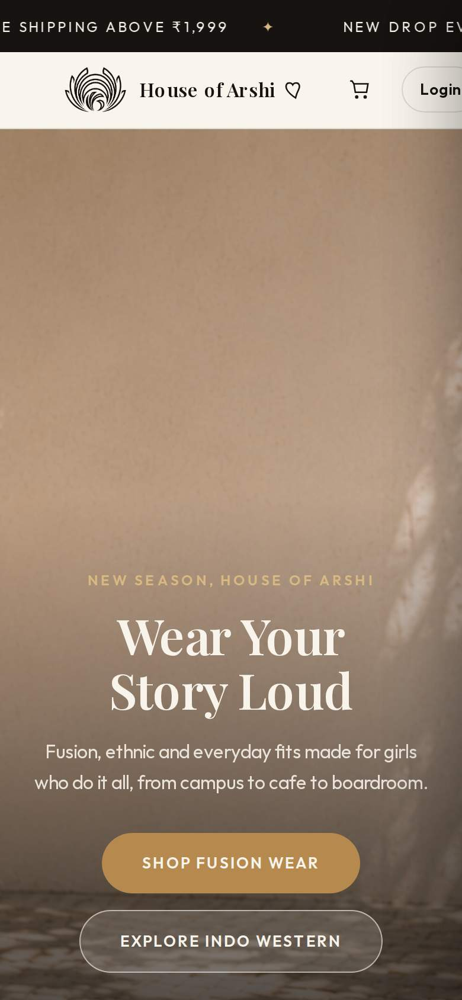</p>

*01: Home on a 390 px phone. There is no menu icon, the Login pill is cut off, and the hero shows only a wall (see [H2](#h2-hero-banners-show-an-empty-wall-on-phones)).*

### C2. There is no navigation menu on phones

**What shoppers see:** there is no menu icon, and the category links and search box are hidden.
The only way to reach a category is to scroll the home page or use the footer links.

**Evidence:** the hamburger button measures **0 × 18 px**, so it can't be tapped. Even a scripted click does nothing.

**Causes**
- **The button is squeezed to zero width.** It's a flex item whose three lines have percentage widths, so its minimum width is 0. The over-full navbar then shrinks it away (`style.css:314–321`).
- **The menu it opens doesn't exist.** `toggleMobileMenu()` toggles `#mobileMenu` (`app.js:813–815`), but no page has an element with that id.
- **Nav links and search are hidden below 720 px** (`style.css:2090–2092`).

**Fix**
- Give `.burger` `flex-shrink: 0` and a 44 × 44 px tap area.
- Add an off-canvas menu containing:
  - categories and sub-categories
  - search
  - Login / My account
  - wishlist and bag
  - contact / WhatsApp
- Add `aria-expanded` and `aria-controls` to the button. Close the menu on overlay tap or Esc, and lock background scrolling while it is open.

The navbar is copied into 20 HTML files. The simplest roll-out is to **build the menu once in `app.js` from `SITE_STRUCTURE`**, which is already loaded on every shop page. The alternative is to update `dev-tools/partials.py` first ([L3](#5-low-priority-p3)) and regenerate the pages.

### C3. The product popup is unusable on phones and tablets

**What shoppers see:** tapping a product opens a black panel with a cropped photo. The name,
price, sizes, *Add to Cart* and *Buy Now* are not visible and can't be scrolled to
(screenshots 02, 03). **Nobody on a phone or tablet can add anything to the bag.**

**Evidence**
- **390 px phone:** the popup's grid is `990px 40px`, a 990 px gallery column plus a 40 px info column. *Add to Cart* sits at x ≈ 1,091 px, inside a 367 px-wide popup that hides overflow.
- **768 px tablet:** the grid is `966px 72px`, and *Add to Cart* is at x ≈ 1,176 px.

**Cause: CSS rule order.** The `@media (max-width: 980px)` block (`style.css:1470–1498`) comes *before* the component rules it is meant to override:

- `.product-modal` (line 1514)
- `.modal-gallery` (1550)
- `.modal-dots` (1580)
- `.modal-thumbs` (1603)
- `.modal-info` (1634)
- `.modal-actions` (1717)

With equal specificity the later rule wins, so every phone/tablet override is silently ignored.

**Fix (verified):**
- Move the whole block below the last component rule, just above `@media (max-width: 720px)`.
- On phones, use `grid-template-columns: minmax(0, 1fr)` and slimmer action buttons ([Appendix D](#appendix-d-verified-css-patch)).

On the patched copy, a real touch test at 360 px and 390 px worked end to end: tap photo → tap size *M* → tap *Add to Cart* → the bag badge shows 1 (screenshot 13).

**Then polish** ([Phase 3](#8-recommended-fix-plan))
- Use a portrait (3:4) gallery on phones. Once fixed, the current 4:3 frame shows the kurti at just over a third of the popup's width (screenshot 13).
- Add swipe between photos. A drag currently selects text instead.
- Make the popup a full-screen sheet (`100dvh`).
- Keep the sticky *Add to Cart* bar, which is already styled.

<p>
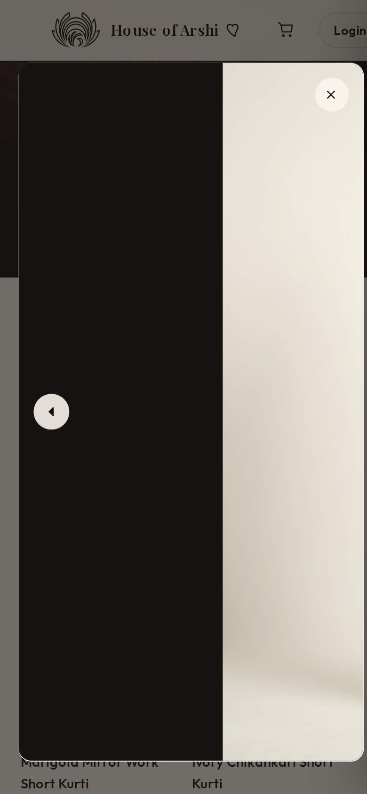
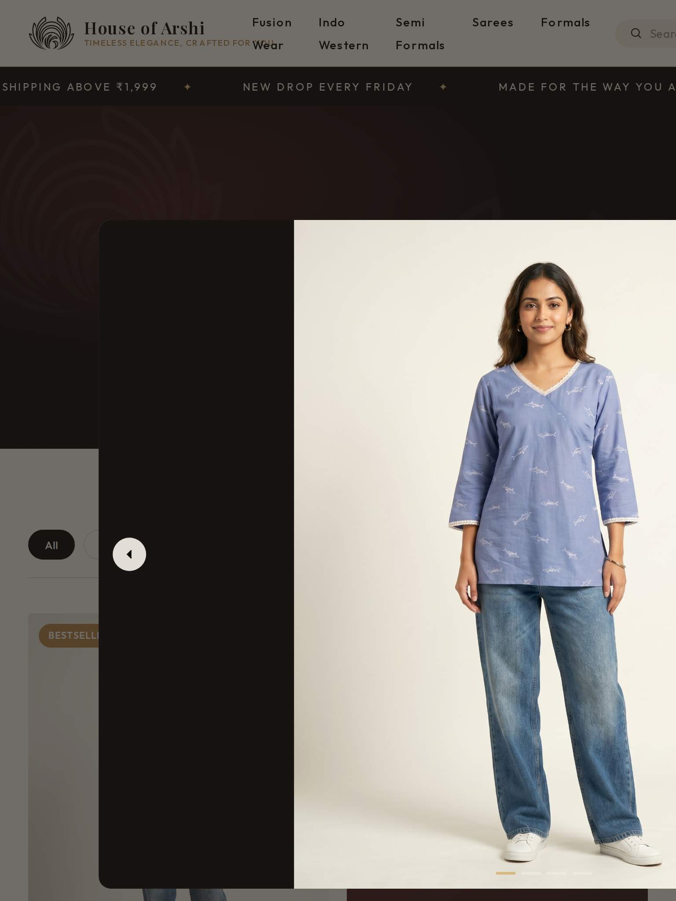
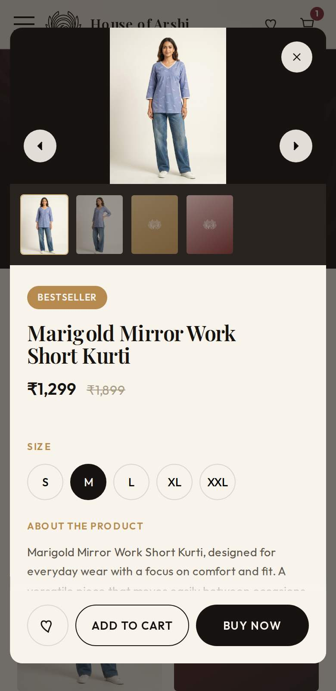
</p>

*02: phone today · 03: tablet today · 13: phone after the verified fix.*

### C4. Bag page and checkout break on phones and tablets

**What shoppers see**
- **Bag page:** the Order Summary box covers the items. The total and *Proceed to Checkout* are cut off at the right (screenshot 04).
- **Checkout:** the form and summary sit side by side on a phone. The Order Summary and **Place Order** are off-screen to the right, and name/email are squeezed into narrow side-by-side fields ("Your full nar…") (screenshot 05).

**Evidence**
- **Bag page:** the grid measured `0px 360px`, so the item column is 0 px wide.
- **Checkout:** the grid measured `297px 380px`, the page is 745 px wide, and *Place Order* sits at x = 393–717 px on a 390 px screen.

**Cause:** the same rule-order bug as C3. These base rules come after the 980 px block and cancel it:

- `.cart-page-layout` (1765)
- `.cart-page-summary` (1874)
- `.checkout-layout` (1909)
- `.form-row` (1941)
- `.checkout-summary-box` (2000)

**Fix:** the same single move fixes both pages. On the patched copy, the bag and checkout become single-column with their buttons on screen (screenshot 14).

<p>
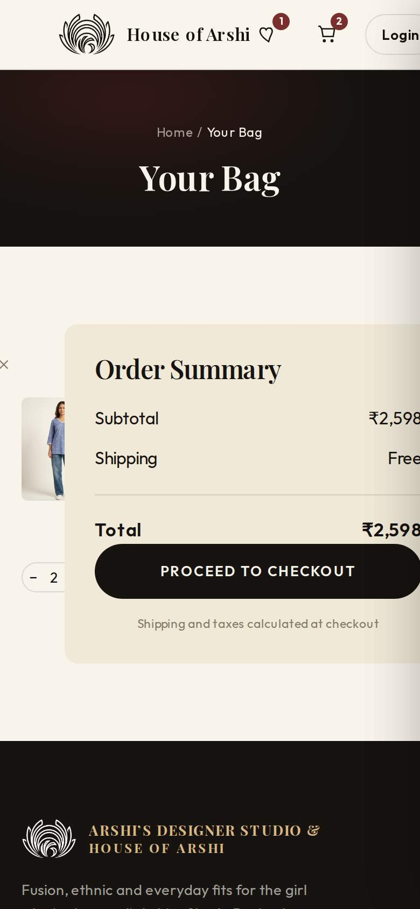
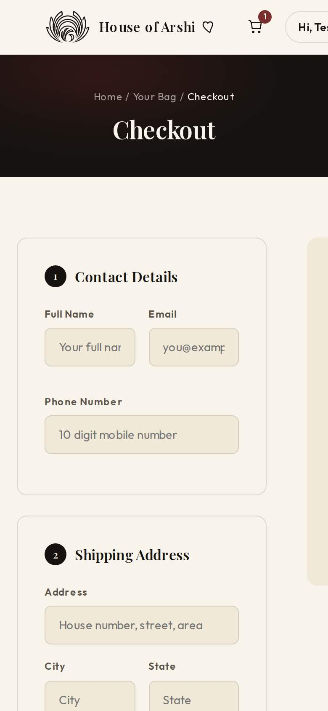
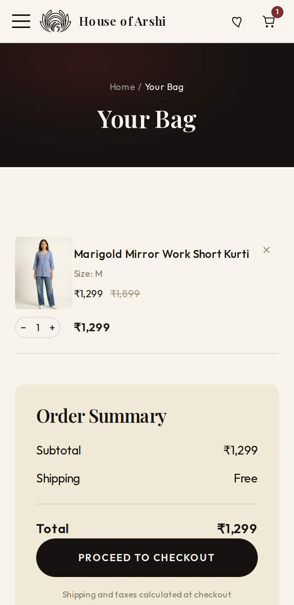
</p>

*04: bag today · 05: checkout today · 14: bag after the verified fix. The menu icon also reappears and the grey right-edge shadow is gone.*

### C5. Bag page +/− and remove buttons crash for guests

**Evidence:** tapping **+** on the bag page throws `ReferenceError: sk1_M is not defined`. The quantity doesn't change and *remove* does nothing.

**Cause:** `app.js:585–590` writes the item ID into `onclick` without quotes, producing `changeQty(sk1_M, -1)`. Guest IDs are strings like `sk1_M`, so the browser reads them as variable names. The cart drawer version (`app.js:523–527`) quotes them correctly.

**Fix:** write `changeQty('${item.cartItemId}', -1)` (and the same for `+` and remove). Better still, use `data-id` attributes with one delegated click listener. Also close the unclosed `<button class="cart-remove">` in `renderCart()` (`app.js:527–528`).

### C6. Login, sign-up and checkout fail for everyone on the live site

This affects all devices, not only phones.

- **The site calls the visitor's own device.** `API_BASE_URL = "http://localhost:8000"` (`assets/api-client.js:8`), so every login or sign-up shows *"Could not reach the server"* (screenshot 07).
  - Checkout requires login (`pages/checkout.html:15`), so the purchase path ends at this page.
  - *Proceed to Checkout* sends guests straight to it.
- **Online payment fails even with a working backend.** With the backend mocked in our test, choosing UPI or card still failed:
  - The order is created on the server first.
  - The page then shows *"Razorpay is not defined"*, because no page loads the Razorpay checkout script (`app.js:438`; screenshot 06).
  - That leaves unpaid orders on the server.
- **The checkout still says it's a preview:** *"This is a preview, no real payment will be processed"* (`checkout.html:149`).

**Fix**
- Deploy the API on HTTPS and set its URL per environment.
- Load `https://checkout.razorpay.com/v1/checkout.js` on the checkout page, and make sure it has loaded before creating the order.
- Consider **guest checkout**. Forced sign-up is a major drop-off point on phones.
- Remove the preview note.
- Until the backend is live, hide *Login*/*Checkout*, or add an interim *"Order on WhatsApp"* button to the product popup.

<p>
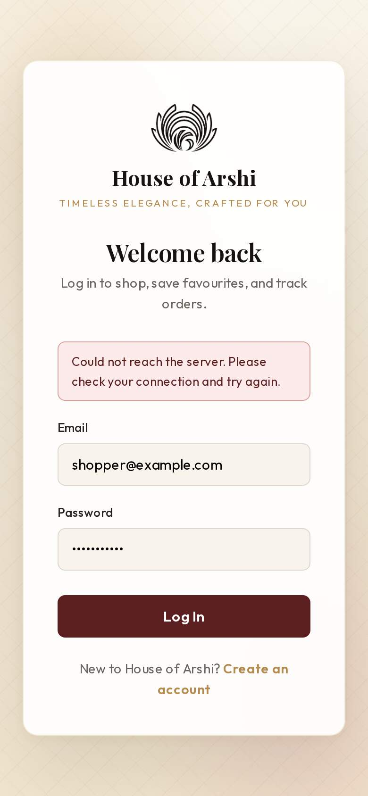
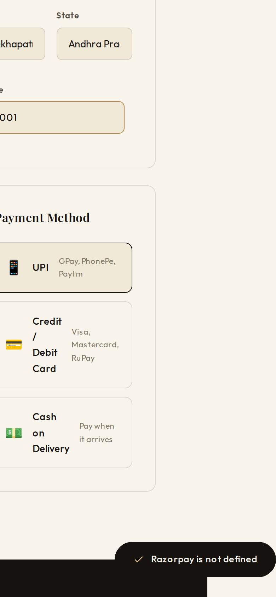
</p>

*07: every login attempt on the live site · 06: payment step once a backend exists. The page is also scrolled sideways (C4), and the error shows a success tick (M3).*

---

## 3. High priority (P1)

### H1. The home page downloads ~12 MB on a phone

**Lighthouse** (mobile, simulated slow 4G): LCP ≈ **51 s**, total transfer **11,578 KiB (~11.9 MB)**,
and *"Improve image delivery"* estimates **9.6 MB** of savings. Even on a good 20 Mbit/s connection
the images alone take about 5 s, and each visit costs the shopper about 12 MB of mobile data.

| Image | File size | Pixels | What it's used for on a 390 px phone |
|---|---|---|---|
| `sections/slideshow2.png` | 2.7 MB | 1672×941 | Hero slide 2 (downloaded up front, shown later) |
| `sections/slideshow3.png` | 2.7 MB | 1659×948 | Hero slide 3 (downloaded up front, shown later) |
| `sections/Slide1hero.png` | 2.3 MB | 1915×821 | Hero slide 1 (the LCP element) |
| `products/Heroimagesk1.jpeg` | 2.1 MB | 1792×2400 | A ~170 × 230 px tile |
| `sections/newletterpopup.png` | 1.9 MB | 1442×1091 | **Nothing:** hidden on phones but still downloaded |

**Causes**
- Four of the five photos are saved as PNG, a format meant for graphics, and none is resized for the screen.
- There is no `srcset`/`sizes` and no `loading="lazy"`.
- All three hero slides load up front.
- The popup image is injected on page load (`index.html:366`).
- Every file is served with `Cache-Control: public, max-age=0, must-revalidate`, so repeat visits re-check every file with the server.

**⚠️ This will get worse as photos are added.** The only real product photo is 2.1 MB. At that
size, a 6-product category page would be about 13 MB. The developer guide already says
*900×1200 px, under 500 KB*; aim lower still:

**Fix**
- **Formats and sizes:** export photos as **WebP or AVIF** (JPEG fallback) in 2–4 widths (e.g. 480 / 828 / 1200 / 1920 px), served with `srcset` + `sizes`. Target ≤ 150 KB per product card and ≤ 250 KB for a phone hero.
- **Loading order:**
  - `loading="lazy"` and `decoding="async"` for everything below the fold.
  - For the first hero slide, `fetchpriority="high"` plus a `<link rel="preload">`.
  - Load slides 2–3 only after slide 1 is showing.
- **Popup image:** inject it only when the popup opens, and not at all on phones.
- **Caching:** long-lived caching for images, CSS and JS in `vercel.json`, using versioned file names.
- **Roll-out:** `app.js` builds every image tag from the data files (`imgTagWithFallback`, `productThumbHTML`), so adding `srcset`/`loading` there upgrades every image on the site at once.

### H2. Hero banners show an empty wall on phones

On phones the hero fills 92 % of the screen height (`style.css:383–386`), but the banners are wide landscape images (about 2.3:1).
With `object-fit: cover`, a 390 px phone keeps only the centre **22–29 %** of each image's width.
In `Slide1hero.png` the two models stand at the far left and far right, so the phone shows only
the blank wall between them. Both products disappear (screenshot 01).

**Fix:** portrait crops (4:5 or 9:16) served through `<picture><source media="(max-width: 720px)" …>`.
Alternatively, use a shorter hero on phones (e.g. `min(80svh, 640px)`) with `object-position` set per slide.

### H3. Tablets and small laptops get a desktop menu that doesn't fit

From 721 px upward the full desktop navbar is shown, but it needs **945 px** (screenshot 08):

- The links wrap onto two lines, and the tagline runs into "Fusion Wear".
- Search, the bag and *Login* are pushed off-screen.
- A 768 px iPad lays the page out at 945 px (872 px on pages without a search box).
- Even at 1024 px and 1180 px, the links still wrap onto two lines.

**Fix:** use the mobile menu up to about 1180 px. Alternatively, between 721 and 1180 px hide the tagline, collapse search to an icon, and add `white-space: nowrap` to the links.

<p></p>

*08: navbar on a 768 px tablet.*

### H4. A newsletter popup interrupts every new visit on phones

**What happens:** 1.8 s after the first page of each browser session, a popup with a dark overlay covers the page (`app.js:763–776`; screenshot 09).
- On phones, Google's search guidelines treat this kind of intrusive interstitial as a negative.
- *"No thanks, I will pay full price"* is a 15 px-tall `<a>` without an `href` (`index.html:300`). It isn't a real link or button for keyboard and screen-reader users.

**It also over-promises.** The success message says *"Check your inbox for your code"*, but
nothing is sent. The email address is thrown away (`app.js:783–788`), and the footer *Join* form only shows a toast.

**Fix**
- Show the popup later (e.g. after 50 % scroll or 30 s) as a small bottom sheet on phones.
- Never show it on the bag or checkout pages.
- Remember a dismissal for 14–30 days (`localStorage`).
- Connect a real mailing list (e.g. a Mailchimp, Brevo or Klaviyo form endpoint) before promising a code.

<p>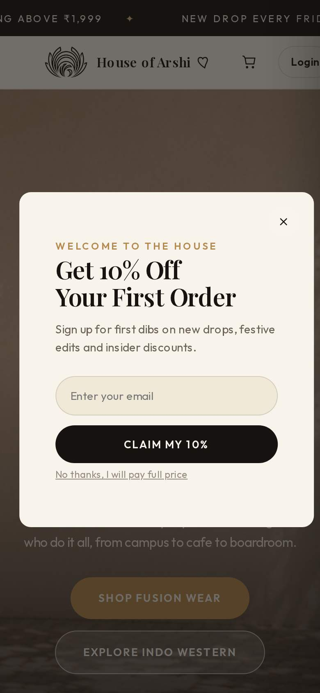</p>

### H5. Tap targets are too small

On the home page at 390 px, **55 of 84** tappable elements are smaller than 44 × 44 px, and
**16 are smaller than 24 × 24 px**, the WCAG 2.2 AA minimum.

| Element | Size (px) | Where |
|---|---|---|
| Hero slide dots | 28 × 3 | `style.css:455` |
| Footer, contact and legal links | 20–22 tall | Footer on every page |
| Breadcrumb links | 15 tall | Category page headers |
| Bag quantity − / + | 26 × 26 | Drawer and bag page (`style.css:1092`) |
| Wishlist hearts | 34 × 34 | Every product card (`style.css:529`) |
| Filter chips | 34 tall | Category pages (`style.css:1305`) |
| Nav icons, social icons, popup close buttons | 36 × 36 | `style.css:250`, `813` |
| Size pills | 42 × 42 | Product popup (`style.css:1690`) |

**Fix:** make every target at least 44 × 44 px (48 px preferred). Either add padding or an invisible hit area (`::after { inset: -8px }`), and give footer links vertical padding.

### H6. Inputs zoom the page on iPhone, and checkout isn't autofill-friendly

**Every text input is 13–15 px:** search 13, footer newsletter 13, popup newsletter 13.5, checkout 14, login/sign-up 15. iPhone Safari zooms in on any field smaller than 16 px when it's tapped, and the page stays zoomed afterwards.

**The checkout form works against phones** (`checkout.html:80–111`):
- No field has an `autocomplete` token, so phones can't autofill name, address or phone.
- The PIN code field is `type="text"`, so it opens the full keyboard instead of the number pad.
- The phone pattern `[0-9]{10}` rejects "+91 98765 43210".

**Fix**
- Use `font-size: 16px` for inputs on phones.
- Give each field its `autocomplete` token: `name`, `email`, `tel`, `street-address`, `address-level2` (city), `address-level1` (state), `postal-code`.
- Add `inputmode="numeric"` to the PIN code field.
- Accept `+91` and spaces in the phone field, then normalise the number in JS.

### H7. The back button leaves the page, and products have no links

**The back button doesn't close the popup.** The product popup doesn't add a browser-history entry, so the Android back gesture (the natural way to "close" something on a phone) exits the category page instead.

**Products have no URLs** (`href="javascript:void(0)"`).
- Shoppers can't share a product on WhatsApp or Instagram.
- Search engines can't index products; Lighthouse reports *"Links are not crawlable"*.

**Fix**
- **Short term:** on open, call `history.pushState({ product: id }, '', '#p-' + id)`. Close the popup on `popstate`, and open it on page load when that hash is present.
- **Long term:** give each product a real page (the Python generators can produce them) and keep the popup as a quick view.

### H8. On product cards, only the photo responds to a tap

Tapping the product name or price does nothing, because `.product-info` isn't a link. The *View Product* bar only slides in on mouse
hover (`transform: translateY(100%)`, `style.css:553–567`), so phone users never see it.

**Fix:** make the whole card one link or button, and under `@media (hover: none)` show a visible *View* / *Quick add* control.

---

## 4. Medium priority (P2)

**M1. SEO and link previews are missing on every page.**
- **Missing tags:** no `<meta name="description">`; no Open Graph or Twitter tags, so links shared on WhatsApp or Instagram get no preview image or description; no canonical URLs; no `theme-color`.
- **Missing files:** favicon and apple-touch-icon (both 404), `robots.txt` (404), `sitemap.xml` (404).
- **Missing structured data:** no `Organization`, `Product` or `BreadcrumbList`.
- **Content search engines can't see:** product grids are drawn by JavaScript after load, and the "Read More" link text isn't descriptive.
- **Lighthouse SEO:** 73 (home), 82 (category).

Google indexes the mobile version of a site first, so this is mobile SEO.

**M2. A grey shadow runs down the right edge of every page, on every screen size.** The closed bag and
wishlist drawers sit just off-screen but keep their 60 px shadow (`style.css:1033`), which bleeds into
view (visible in screenshots 04, 11 and 12, and on desktop). The closed drawers also stay in the keyboard tab order.
*Fix:* apply the shadow only to `.drawer.active` (verified), and add `visibility: hidden` when a drawer is closed.

**M3. Toasts are cut off and can mislead.**
- `white-space: nowrap` (`style.css:1222`) makes *Added "Marigold Mirror Work Short Kurti" (Size M) to your bag* run off both edges of a phone screen (screenshot 10).
- Error messages use the same tick icon as success messages (*"✓ Razorpay is not defined"*).

*Fix:* let the text wrap within `max-width: calc(100vw - 32px)` (verified), and give errors their own style.

<p>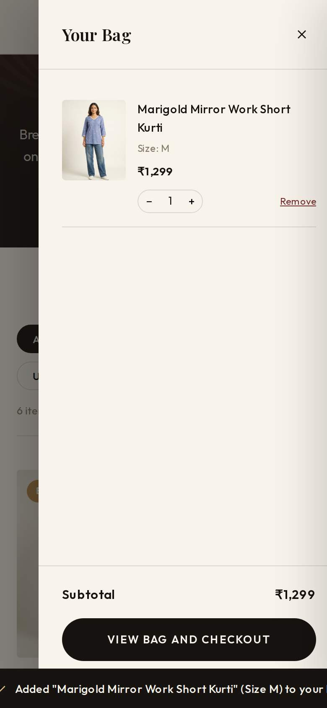</p>

**M4. Two mobile-browser quirks.** Both come from code review; iPhone Safari is where they show up most.
- **`vh` units:** the drawers use `height: 100vh` (`style.css:1026`) and the hero uses `92vh` (`style.css:385`). On phone browsers `vh` includes the area behind the address bar, so the drawer's *View Bag and Checkout* button can end up under the browser toolbar. Use `100dvh` (with a `100vh` fallback), and `svh` for the hero.
- **Scroll lock:** background scrolling is locked with `document.body.style.overflow = 'hidden'` (`app.js:731`, `modal.js:27`). iOS Safari ignores that, so the page scrolls behind open drawers and popups. Add `overscroll-behavior: contain` and a proper scroll lock.

**M5. The wishlist *View* button crashes on 6 pages:** About, bag, checkout, Formals, Fusion Wear and
order confirmation. Those pages don't include the product popup markup, so the button throws
`Cannot set properties of null (setting 'innerHTML')` (`modal.js:97`).
*Fix:* include the popup on every page, or link to the product instead.

**M6. There is no search on phones.** The search box is hidden below 720 px (`style.css:2092`). On larger
screens it only filters products already on the current page (`app.js:740–760`), and on the home page only the featured cards.
*Fix:* a search icon that opens a full-screen search across all products (`PRODUCTS`).

**M7. Text is small and low-contrast.**
- **Size:** on the home page, 43 text elements are smaller than 12 px (10 px "Photo coming soon", 10.5 px product tags, 11.5 px "Shop Now"), and 65 % of all text is smaller than 14 px.
- **Contrast:** WCAG AA needs 4.5:1. Today:
  - Gold `#B68A4E` on ivory is **2.84:1**. This covers eyebrow headings, product tags, and ivory text on the gold *Shop Fusion Wear* button.
  - The strike-through MRP (`#A89C87`) is 2.46:1.
  - Result counts and meta text (`#847A68`) are 3.86:1.
- *Fix:*
  - Keep the light gold for decoration only.
  - Add a text gold such as `#86622F` (5.0:1 on ivory, 4.6:1 on ivory-deep) and a text grey `#6F665A` (5.1:1).
  - Use at least 12 px for labels and 14–16 px for body text.

**M8. Fonts cause layout shift and delay the first paint.**
- Category pages score CLS **0.106**, above Google's 0.1 "good" limit, because the page title and logo jump when the web fonts swap in.
- The Google Fonts stylesheet blocks rendering (estimated 300–950 ms).
- Nine font weights are requested.
- There's no `preconnect` to `fonts.gstatic.com`.

*Fix:*
- Self-host two families with 2–3 weights each as WOFF2, and `preload` them.
- Add metric-matched fallback fonts (`size-adjust`/`ascent-override`), or use `font-display: optional`.

**M9. Opening FAQ, Privacy or Terms makes the page wider:** 700–760 px on phones, 1,504 px on a
768 px tablet. The cause is the `margin: 0 -100vw; padding: 0 100vw` trick (`style.css:929–930`).
*Fix:* `box-shadow: 0 0 0 100vmax var(--black-soft); clip-path: inset(0 -100vmax)` (verified).

**M10. Accessibility gaps.**
- **Page structure:** no `<main>` landmark; heading levels skip (footer `h4` directly after `h2`).
- **Forms:** the newsletter inputs have no label, only a placeholder.
- **Dialogs:** the popups and drawers have no `role="dialog"` or `aria-modal`, don't trap focus, and don't return focus when closed. Only the product popup closes on Esc.
- **Buttons:** the menu button has no `aria-expanded`.
- **Motion:** the hero auto-advances every 4.5 s with no pause control and ignores the reduced-motion setting (`app.js:807–809`).

**M11. "Photo coming soon" placeholders overlap titles** on phone tiles (e.g. "Anarkali Suit Sets") and
on the About hero headline (screenshots 11 and 12). This goes away once photos are added. Until then, hide the note on small tiles.

<p>
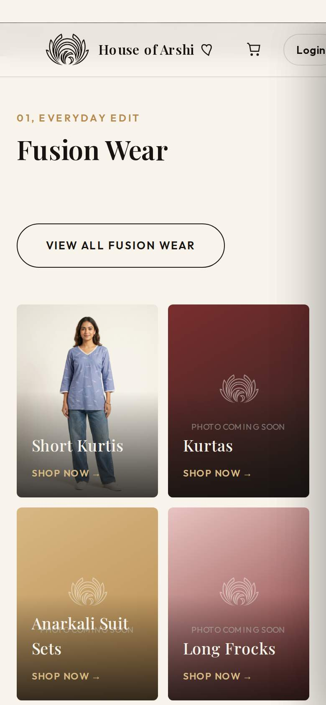
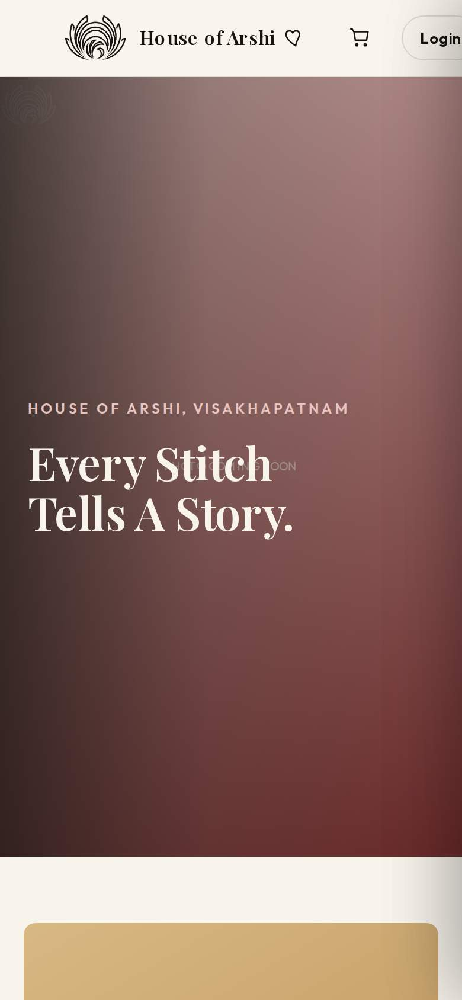
</p>

---

## 5. Low priority (P3)

- **L1. Developer files are publicly downloadable.**
  - `https://www.houseofarshi.com/docs/DEVELOPER_GUIDE.md`, `/dev-tools/*.py` and `/dev-tools/logo-source/*` all return 200, because they sit inside the deployed folder.
  - *Fix:* move `docs/` and `dev-tools/` to the repository root (Vercel only deploys `house-of-arshi-site/`), and stop committing `__pycache__/`.
- **L2. Dead links.**
  - *Contact* and the Instagram, Pinterest and WhatsApp icons all point to `#` on every page.
  - The WhatsApp icon isn't recognisable.
  - For phone shoppers in India, a `https://wa.me/917680890071` link is the most useful contact option.
- **L3. The page generators are out of sync with the pages.**
  - `dev-tools/partials.py` has an older footer: no contact block, no FAQ/Privacy/Terms, and no `footer-legal.data.js`.
  - Re-running the generators would silently remove those from every generated page.
  - Sync `partials.py` with the live markup before using it to roll out the new navbar.
- **L4. Inconsistencies.**
  - The announcement bar sits above the navbar on the home page but below it everywhere else.
  - Login and sign-up have no header and no link back to the shop.
  - Category pages ship "10 items" in the HTML, but there are 6 products.
  - Two home sections are both numbered "03".
  - Category headers contain an empty ``.
  - The developer guide lists pages that no longer exist and says there are 10 products per category; there are 6.
- **L5. No branded 404 page.** Vercel's plain-text default is shown.
- **L6. Scripts load synchronously.** Seven scripts load this way on every shop page, including the 69 KB product catalogue on pages that list no products.
  - *Fix:* add `defer`, and later load catalogue data per category.
- **L7. Visual nits.**
  - The "2024 Est. With Love" tag pokes 4 px off-screen on phones (`.floating-tag { left: -24px }` against 20 px of page padding).
  - On desktop, six Fusion tiles in a 4-column grid leave an orphan row, and the Formals hub has 3 tiles in 4 columns.

---

## 6. Content & trust issues (owner actions, not code)

- **Only 1 of 72 products has a photo** (2 of 288 gallery slots are filled). Every other card, and 5 of the 6 home tiles, shows a "Photo coming soon" gradient.
- **Placeholder copy is live** on the About page: *"[Filler, replace with your story]"*, *"[Year]"* and similar (`about.html:63, 77, 115, 117`).
- **The policies contradict each other:**
  - **Shipping:** the bag and checkout always say *Shipping: Free*, but the FAQ charges ₹99 below ₹1,999.
  - **Sizes:** the FAQ promises sizes XS–XXL and *"a size chart on each product page"*. Products list S–XXL, and there is no size chart.
  - **Returns:** the About page says *"easy 7 day returns"*; the FAQ says exchange only, no refunds.
- **The 10 % popup promises an emailed code that is never sent** ([H4](#h4-a-newsletter-popup-interrupts-every-new-visit-on-phones)).
- **Checkout still says "This is a preview, no real payment will be processed"** ([C6](#c6-login-sign-up-and-checkout-fail-for-everyone-on-the-live-site)).

---

## 7. What already works well

- **Solid basics:** all 22 pages have a correct `<meta name="viewport">` tag and `lang="en"`.
- **A clean design system:** colours and fonts are CSS variables, and the component styling is consistent. That makes the fixes above straightforward.
- **Several responsive rules already work,** because they come after their base rules:
  - product grids drop to 2 columns
  - the footer stacks
  - the About rows stack
- **Accessibility foundations:** `:focus-visible` outlines and a `prefers-reduced-motion` block are already in place.
- **Very little JavaScript cost:** Total Blocking Time is 0–60 ms, and layout shift on the home page is near zero.
- **Good hosting setup:** Vercel serves HTTP/2 with Brotli compression and HSTS, and `houseofarshi.com` redirects to `www`.
- **Easy bulk upgrades:** all products and images come from data files, so an upgrade such as responsive images can be rolled out in one place.
- **Well-built sign-in forms:** the login and sign-up inputs have proper labels and `autocomplete` values.

---

## 8. Recommended fix plan

**Effort:** S = a few hours · M = about a day · L = several days or depends on others.

**Phase 1: make phones work.** Mostly CSS/JS, low risk; do this first.

| # | Change | Fixes | Effort |
|---|---|---|---|
| 1 | Move the 980 px media block and tweak the popup actions ([Appendix D](#appendix-d-verified-css-patch)) | C3, C4 | S |
| 2 | Compact phone navbar; `flex-shrink: 0` on the burger ([Appendix D](#appendix-d-verified-css-patch)) | C1, C2 | S |
| 3 | Build `#mobileMenu` in `app.js` from `SITE_STRUCTURE`, with Login/Account, wishlist, search and contact | C2, M6 | M |
| 4 | Quote the bag-page IDs; add the missing `</button>` | C5 | S |
| 5 | Login circle width, FAQ panel, drawer shadow, toast wrapping ([Appendix D](#appendix-d-verified-css-patch)) | C1, M2, M3, M9 | S |
| 6 | 16 px inputs with `autocomplete` and `inputmode` | H6 | S |
| 7 | Use the mobile menu up to about 1180 px | H3 | S |
| 8 | Re-test at 360, 390, 412, 768 and 1024 px | — | S |

**Phase 2: make it fast.**

| # | Change | Fixes | Effort |
|---|---|---|---|
| 1 | Re-export images (WebP/AVIF, 2–4 sizes); add `srcset`/`sizes` and lazy loading; portrait hero crops for phones | H1, H2 | M |
| 2 | Load the popup image on demand; defer slides 2–3; preload slide 1 | H1 | S |
| 3 | Add cache headers in `vercel.json`, with versioned file names | H1 | S |
| 4 | Self-host fonts, preload them, and use fewer weights | M8 | S |
| 5 | Add `defer` to scripts | L6 | S |

**Phase 3: make shopping pleasant on touch.**

| # | Change | Fixes | Effort |
|---|---|---|---|
| 1 | Product popup: 3:4 gallery, swipe (CSS scroll-snap), full-screen sheet, back-button support | C3 polish, H7 | M |
| 2 | Make whole product cards tappable, with a visible "View" control on touch | H8 | S |
| 3 | 44 px tap targets across the site | H5 | S |
| 4 | Newsletter popup timing and bottom sheet; real email capture | H4 | M |
| 5 | Contrast colours and font-size scale | M7 | S |
| 6 | Dialog accessibility, `<main>`, input labels, hero pause control | M10 | M |
| 7 | `100dvh` and an iOS-safe scroll lock | M4 | S |
| 8 | Include the popup markup on every page | M5 | S |

**Phase 4: launch readiness.** Beyond mobile.

| # | Change | Fixes | Effort |
|---|---|---|---|
| 1 | Deploy the API on HTTPS, load Razorpay, add guest checkout, or offer WhatsApp ordering as an interim option | C6 | L |
| 2 | Product photos, About copy, consistent shipping/size/returns policies | §6 | L (content) |
| 3 | Meta and Open Graph tags, favicon set, `robots.txt`, `sitemap.xml`, JSON-LD, product URLs | M1, H7 | M |
| 4 | Move the dev files, fix dead links, sync the generators, add a 404 page | L1–L5 | S |

---

## 9. Targets for "done"

- On every page, the layout width equals the screen width at 320, 360, 390, 412, 768 and 1024 px. That includes the menu, bag, popups and FAQ panels when open.
- At 360 px, the whole purchase works by touch alone: menu → category → product → size → *Add to Cart* → bag → checkout → payment.
- No JavaScript errors appear in the console on any page.
- **Lighthouse mobile:** Performance ≥ 90, LCP ≤ 2.5 s, CLS ≤ 0.1, Accessibility ≥ 95, SEO ≥ 95.
- **Page weight:** the home page is ≤ 1.5 MB on a phone, and no single image is larger than 250 KB.
- **Touch and readability:** tap targets are ≥ 44 × 44 px, form inputs are 16 px, and text contrast is ≥ 4.5:1.

---

## Appendix A: How the audit was done

- **Scope:** all 22 HTML pages, `style.css`, `app.js`, `modal.js`, `api-client.js`, the data files, and the `dev-tools/` generators.
- **Live site checks:**
  - The site is served by Vercel from the `house-of-arshi-site/` folder, with HTTP/2, Brotli compression and HSTS.
  - `houseofarshi.com` redirects to `www` with a 308.
  - Nine key files (home page, 3 other pages, CSS, 2 JS files, 2 data files) are byte-identical to `main` at `abfc131`.
- **Real-browser tests:** Chromium (Playwright 1.56) with mobile and touch emulation.
  - **Screen sizes:**
    - 360×780 (typical Android)
    - 390×844 (iPhone 12–15)
    - 412×915 (large Android)
    - 768×1024 and 1024×768 (iPad)
  - **Measured on 13 pages:** layout width, tap-target sizes, font sizes and console errors.
  - **Flows walked:** menu → product popup → add to bag → bag drawer → bag page → checkout (with the API mocked) → login.
- **Lighthouse 13.5**, mobile preset (simulated slow 4G, 4× CPU slowdown), 5 pages × 2 runs each.
  - The audit machine's browser couldn't load the live domain directly, so Lighthouse and the browser tests ran against a byte-identical local copy.
  - That copy was served with Vercel's headers (Brotli, same cache policy), with Google Fonts on a separate origin.
  - Expect small differences from PageSpeed Insights; the causes are the same.
- **Fix preview:** the CSS changes in Appendix D were applied to a scratch copy only and re-measured. **No site files were changed** by this audit.
- **Not covered:**
  - real iOS Safari and Android hardware (the M4 quirks come from code review)
  - the backend API and live payments
  - field data from real visitors (Chrome UX Report)

## Appendix B: Per-page measurements

*Page width* is the width the browser lays the page out at; it should equal the screen width.
**Bold** means wider than the screen. Tap targets, text sizes and input sizes were measured on a 390 px phone.

| Page | Width @ 360 | @ 390 | @ 412 | @ 768 | Tap targets < 44 px | < 24 px | Text < 12 px | Inputs < 16 px |
|---|---|---|---|---|---|---|---|---|
| index.html | **405** | **405** | 412 | **945** | 55 of 84 | 16 | 43 | 1 of 1 |
| pages/fusion-wear.html | **405** | **405** | 412 | **945** | 24 of 30 | 15 | 13 | 1 of 1 |
| pages/short-kurtis.html | **405** | **405** | 412 | **945** | 41 of 47 | 16 | 11 | 1 of 1 |
| pages/indo-western.html | **405** | **405** | 412 | **945** | 40 of 46 | 15 | 12 | 1 of 1 |
| pages/semi-formals.html | **405** | **405** | 412 | **945** | 40 of 46 | 15 | 11 | 1 of 1 |
| pages/sarees.html | **405** | **405** | 412 | **945** | 40 of 46 | 15 | 13 | 1 of 1 |
| pages/formals.html | **405** | **405** | 412 | **945** | 24 of 27 | 15 | 8 | 1 of 1 |
| pages/suits.html | **405** | **405** | 412 | **945** | 41 of 47 | 16 | 11 | 1 of 1 |
| pages/about.html | **405** | **405** | 412 | **872** | 23 of 23 | 14 | 6 | 1 of 1 |
| pages/cart.html (empty) | **405** | **405** | 412 | **872** | 24 of 25 | 15 | 2 | 1 of 1 |
| pages/wishlist.html | **405** | **405** | 412 | **872** | 24 of 25 | 15 | 2 | 1 of 1 |
| pages/login.html | **540** | **555** | **566** | 768 | 1 of 4 | 0 | 1 | 2 of 2 |
| pages/signup.html | **540** | **555** | **566** | 768 | 1 of 6 | 1 | 1 | 4 of 4 |
| pages/checkout.html (1 item) | — | **745** | — | **884** | — | — | — | 8 of 8 |

The bag page with an item in it is 420–421 px wide on phones ([C1](#c1-pages-are-wider-than-the-phone-screen)).
Kurtas, Anarkali Sets, Long Frocks, Tops, Nightwear, Trousers and Blazers use the same template as Short Kurtis and Suits.

## Appendix C: Lighthouse results

Mobile preset, 2 runs per page. Where the two runs differed, both values are shown.

| Page | Performance | Accessibility | Best practices | SEO | FCP | LCP | TBT | CLS | Transfer size |
|---|---|---|---|---|---|---|---|---|---|
| index.html | 72 | 94 | 96 | 73 | 1.9 s | 51.5 s / 51.3 s | 62 ms / 44 ms | 0.007 / 0.003 | 11.9 MB |
| pages/short-kurtis.html | 97 | 92 | 96 | 82 | 1.1 s | 1.3 s / 1.2 s | 0 ms | 0.106 / 0.105 | 2.2 MB |
| pages/fusion-wear.html | 100 | 92 | 96 | 91 | 1.1 s | 1.4 s | 0 ms | 0.002 | 2.2 MB |
| pages/about.html | 100 | 92 | 96 | 91 | 1.1 s | 1.2 s / 1.4 s | 0 ms | 0.001 | 0.13 MB |
| pages/login.html | 99 | 97 | 96 | 91 | 1.6 s | 1.7 s | 0 ms | 0.009 | 0.10 MB |

**Failing audits**

| Category | Audit | Pages affected / details |
|---|---|---|
| Performance | Image delivery | 9.6 MB of savings on the home page |
| Performance | Render-blocking requests | Google Fonts and `style.css`, 0.3–0.95 s |
| Performance | Layout shift culprits | Category page `h1` and logo (font swap) |
| Accessibility | `color-contrast` | All pages except login |
| Accessibility | `heading-order` | All pages except login |
| Accessibility | `landmark-one-main` | All pages except home |
| SEO | `meta-description` | All pages |
| SEO | `crawlable-anchors` | Home and category pages |
| SEO | `link-text` | Home ("Read More") |
| Best practices | `errors-in-console` | Missing `favicon.ico` (404) |

## Appendix D: Verified CSS patch

This was applied to a scratch copy and re-measured at 360, 390 and 768 px:

- Every page's width now matches the screen on phones.
- The product popup, bag and checkout become single-column, with *Add to Cart*, *Proceed to Checkout* and *Place Order* on screen.
- The menu button is visible again (24 × 18 px, still to be enlarged per H5).
- The FAQ panel no longer widens the page, and toasts fit on screen.

The 768 px tablet layout still needs the navbar change in [H3](#h3-tablets-and-small-laptops-get-a-desktop-menu-that-doesnt-fit).

The exact patch is saved next to this report as [`verified-mobile-css.patch`](verified-mobile-css.patch).
From the repository root, `git apply audit/verified-mobile-css.patch` applies it; `git apply --check` passes against `abfc131`.
The excerpt below abbreviates the removed block.

> ⚠️ This patch hides the navbar's *Login* pill on phones. Ship it together with the new mobile
> menu ([C2](#c2-there-is-no-navigation-menu-on-phones)), which must contain Login / My account.

```diff
--- a/house-of-arshi-site/assets/style.css
+++ b/house-of-arshi-site/assets/style.css
@@ -926,8 +926,8 @@
 .footer-legal-panels {
   border-top: 1px solid rgba(248,244,236,0.12);
   background: var(--black-soft);
-  margin: 0 -100vw;
-  padding: 0 100vw;
+  box-shadow: 0 0 0 100vmax var(--black-soft);
+  clip-path: inset(0 -100vmax);
 }
@@ -1030,9 +1030,8 @@
   transition: transform 0.4s cubic-bezier(0.16,1,0.3,1);
   display: flex;
   flex-direction: column;
-  box-shadow: -20px 0 60px rgba(0,0,0,0.2);
 }
-.drawer.active { transform: translateX(0); }
+.drawer.active { transform: translateX(0); box-shadow: -20px 0 60px rgba(0,0,0,0.2); }
@@ -1219,7 +1218,8 @@
   opacity: 0;
   pointer-events: none;
   transition: opacity 0.3s ease, transform 0.3s ease;
-  white-space: nowrap;
+  width: max-content;
+  max-width: calc(100vw - 32px);
 }
@@ -1467,35 +1467,6 @@
-@media (max-width: 980px) {
-  ... (the whole 29-line block is removed from here) ...
-}
@@ -2085,8 +2056,43 @@
 .confirmation-actions { display: flex; gap: 14px; justify-content: center; flex-wrap: wrap; }
 
+@media (max-width: 980px) {
+  .product-grid { grid-template-columns: repeat(2, 1fr); gap: 20px; }
+  .showcase-strip { grid-template-columns: repeat(2, 1fr); }
+  .about-section { grid-template-columns: 1fr; gap: 40px; }
+  .footer-grid { grid-template-columns: 1fr 1fr; gap: 36px; }
+  .newsletter-popup { grid-template-columns: 1fr; }
+  .newsletter-popup .np-img { display: none; }
+  .about-row { grid-template-columns: 1fr; gap: 32px; padding: 56px 0; }
+  .about-row.reverse { direction: ltr; }
+  .value-cards-grid { grid-template-columns: 1fr; }
+  .product-modal {
+    grid-template-columns: minmax(0, 1fr);   /* was 1fr: let the column shrink to the popup width */
+    grid-template-rows: auto 1fr;
+    height: auto;
+    max-height: 92vh;
+    overflow-y: auto;
+    -webkit-overflow-scrolling: touch;
+  }
+  .modal-gallery { aspect-ratio: 4/3; height: auto; flex-shrink: 0; }
+  .modal-thumbs { position: static; transform: none; opacity: 1; background: var(--black-soft); }
+  .modal-dots { display: none; }
+  .modal-info { height: auto; overflow-y: visible; padding: 28px 24px 32px; }
+  .modal-actions { position: sticky; bottom: 0; background: var(--ivory); margin: 24px -24px -32px; padding: 16px 24px 24px; box-shadow: 0 -8px 16px rgba(248,244,236,0.95); }
+  .cart-page-layout { grid-template-columns: 1fr; }
+  .cart-page-summary { position: static; }
+  .checkout-layout { grid-template-columns: 1fr; }
+  .checkout-summary-box { position: static; }
+  .form-row { grid-template-columns: 1fr; }
+}
+
 @media (max-width: 720px) {
-  .nav-inner { grid-template-columns: auto auto auto; }
+  .nav-inner { display: flex; justify-content: space-between; padding: 10px 16px; gap: 12px; }
+  .nav-left { gap: 12px; min-width: 0; }
+  .burger { flex-shrink: 0; }
+  .nav-logo .mark-img { height: 32px; }
+  .nav-right { gap: 4px; }
+  .nav-account-link { display: none; }   /* moves into the new mobile menu (C2) */
   .nav-links { display: none; }
   .burger { display: flex; }
   .search-box { display: none; }
@@ -2103,7 +2109,9 @@
   .modal-info { padding: 24px 20px 28px; }
-  .modal-actions { margin: 24px -20px -28px; padding: 16px 20px 20px; }
+  .modal-actions { margin: 24px -20px -28px; padding: 16px 20px 20px; gap: 8px; }
+  .modal-actions .btn { padding: 14px 12px; letter-spacing: 0.04em; }
+  .modal-wishlist-btn { width: 48px; height: 48px; }
```

And in both `pages/login.html` and `pages/signup.html`:

```diff
   body.auth-body::before {
-    width: 720px;
-    height: 720px;
+    width: min(720px, 100vw);
+    height: min(720px, 100vw);
```
